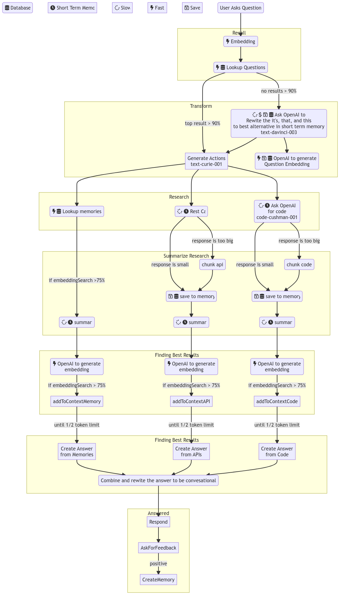
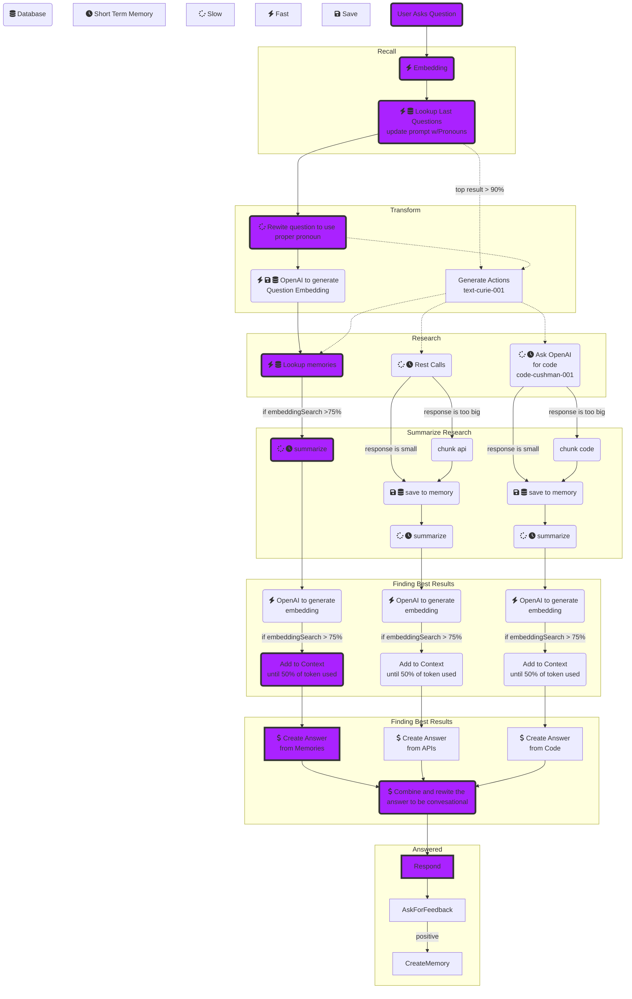

# Scribe.Monster
## Roadmap

- [ ] Core
   - [x] Authentication Targets
      - [x] dbAuth (passwordless)
   - [ ] Security
      - [ ] Table level security
      - [ ] Field level security
      - [ ] Row level security
      - [ ] Roles controlled on your database applied from the group to the user
      - [ ] Field level security
         - [ ] Field data on Read can be hidden (by modifying returned data)
         - [ ] Field data on ReadAll can be hidden (by modifying returned data)
         - [ ] Field data on Create OR Update can be rejected (by changing status from 'success')
         - [ ] Field data on Create OR Update can be removed (by deleting incoming data)
   - [x] Email Providers
      - [x] Mailgun
   - [x] Privacy
      - [x] No third-party data gets your data
      - [x] Users' emails/usernames masked by directives
      - [x] By default, users' can delete their accounts
- [ ] ServiceNow Specific Features
  - [ ] Code Completion (complete)
  - [ ] Code Edits (edit)
  - [ ] Explain Code (explain)
  - [ ] Code Reviews (code-reviewer)
  - [ ] Inline code completion (tbd)
- [ ] Less specific features
   - [ ] Docs
     - [ ] Process Maker
     - [ ] Project Ideas
     - [ ] Product Requirements
     - [ ] Diagrams
   - [ ] Summary
     - [ ] Cliffnotes
     - [ ] Highlights
     - [ ] Deep Dive
   - [ ] AMA
     - [ ] No modifier
     - [ ] Simple Terms
     - [ ] Pirate
     - [ ] Step by step


# Getting Started, want to give it a go?

You have a few options here.

1.  You can play around on the demo site, <https://seedling.tskr.io> with logins and passwords matching for admin, manager, and employee.
2.  Goto [seedling.tskr.io] and click `Deploy to Netlify` to build your repo with proper environment variables.
3.  [Use this template](https://github.com/tskrio/seedling/generate) to get started.  This will generate a Gitpod build to get you up and running.  You will still need a postgres connection URL for your database.

## Running locally

1.  Fork the Repository.
2.  Clone your fork
    ```bash
    git clone https://github.com/tskrio/seedling.git seedling
    ```
3. Go to the project directory
   ```bash
   cd seedling
   ```
4. Install dependencies
   ```bash
   yarn i
   ```
5. Configure a PostgresDB

    This is a bit more involved but you'll need a database **somewhere** either on your machine or hosted somewhere.  I generally set up a https://railway.app postgressql database

   -  Provision a PostgreSQL project.
   -  Click on PostgreSQL, then Connect.
   -  Copy the Postgres Connection URL

6. Configure Environment Variables

   Modify the ./.env file to have a `DATABASE_URL` and `SESSION_SECRET`.  Paste in your connection string and add the following to the end.
   ```
   ?connection_limit=1
   ```

   It should look like so.
   ```
   DATABASE_URL=postgres://<user>:<pass>@<url>/<db>?connection_limit=1
   SESSION_SECRET=replaceme
   ```
7. Push SQL to your database
   ```bash
   yarn rw prisma migrate dev
   ```
8. Generate a new secret
   ```bash
   yarn rw g secret
   ```
   Update your `./.env` file's SESSION_SECRET
9. Start the server
   ```bash
   yarn rw dev
   ```
10. Seed the database
    ```bash
    #not yet written
    ```
    Alt. intstructions
    - Start your server `yarn rw dev`
    - Open the browser and go to http://localhost:8910/
    - Signup
    - Open Prisma Studio `yarn rw prisma studio`
    - Identify your user's ID
    - Create a Group (note the ID)
    - Create a GroupMember with user's ID and group's ID
    - Create a GroupRole with group's ID, and role of `admin`

    From here on out, you can create groups, and users in the browser, but the initial user and rights needed to be set up.  There's an issue with seeding on windows which is why these instructrions are ... long.

## Running in Gitpod

1.  Fork the Repository.
2.  Goto your fork.
3.  Configure a PostgresDB

      This is a bit more involved but you'll need a database **somewhere** either on your machine or hosted somewhere.  I generally set up a https://railway.app postgressql database

     -  Provision a PostgreSQL project.
     -  Click on PostgreSQL, then Connect.
     -  Copy the Postgres Connection URL
4.  Set up your [environment variables](https://gitpod.io/variables) in gitpod.
      |Name|Scope|Value|
      |---|---|---|
      | DATABASE_URL | yourName/seedling | Connection String from above |
      | SESSION_SECRET | yourName/seedling | Well set this later |
3.  [](https://gitpod.io/from-referrer)
5.  When the terminal comes do the following.
6.  Push your schema to your database via `yarn rw prisma migrate dev`.
4.  Generate a new secret via `yarn rw g secret`.
5.  Copy that string and set it in the varables for gitpod.
6.  Stop your workspace via the menu.  Then relaunch it.

# Troubleshooting

Right now, sometimes when setting this up for the first time, permissions aren't always added.  I have an issue to make this better, but until then here's how to get around it.

1.  Goto prisma's studio by running this on your command line; `yarn rw prisma studio`
2.  Verify you have a user you created or admin is there.  If missing, spin up `yarn rw dev` and Sign up and try again.
3.  Still stuck? Verify there's group roles associated to the user and group in question.  If missing, create a group in prisma studio, and a group role of admin.

## Ask Stew Logic

###



